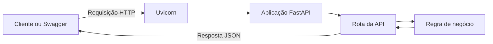
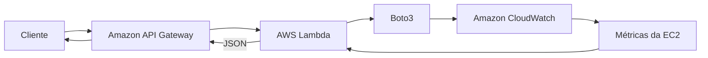

# API de Monitoramento AWS

API REST desenvolvida em Python com FastAPI para analisar métricas de servidores e, futuramente, consultar métricas reais de recursos da AWS.

O projeto está sendo construído progressivamente como parte dos meus estudos de Python, desenvolvimento backend, APIs REST, AWS e DevOps no programa AWS re/Start.

## Objetivos

- Aprender Python por meio de um projeto prático.
- Compreender o funcionamento de uma API REST.
- Aplicar funções, condicionais, tipagem e validação.
- Criar regras de classificação para CPU e memória RAM.
- Integrar Python com serviços AWS utilizando Boto3.
- Consultar métricas de instâncias EC2 no Amazon CloudWatch.
- Preparar a aplicação para AWS Lambda e Amazon API Gateway.

## Status do projeto

Em desenvolvimento.

Funcionalidades concluídas:

- [x] Configuração do projeto com `uv`.
- [x] Aplicação FastAPI executada com Uvicorn.
- [x] Health check da aplicação.
- [x] Regra de classificação da utilização da CPU.
- [x] Endpoint dinâmico para análise de CPU.
- [x] Validação automática do tipo `float`.
- [x] Testes dos estados `normal`, `alerta` e `critico`.
- [x] Teste de entrada inválida com resposta HTTP `422`.
- [ ] Validação do intervalo de CPU entre 0 e 100.
- [ ] Monitoramento de memória RAM.
- [ ] Modelo de entrada com Pydantic.
- [ ] Integração com Boto3, EC2 e CloudWatch.
- [ ] Implantação com Lambda e API Gateway.

## Arquitetura atual



A aplicação funciona localmente. O Uvicorn recebe as requisições HTTP, o FastAPI valida os dados e direciona a requisição para a rota correspondente. A rota chama a regra de negócio e devolve uma resposta JSON.

A documentação completa está em [docs/arquitetura.md](docs/arquitetura.md).

## Arquitetura futura na AWS



A versão futura utilizará:

- Amazon API Gateway para disponibilizar os endpoints.
- AWS Lambda para executar o código Python.
- Boto3 para comunicação com os serviços AWS.
- Amazon CloudWatch para consultar métricas.
- Amazon EC2 como recurso monitorado.
- IAM Role seguindo o princípio do menor privilégio.

## Regras de classificação da CPU

| Utilização | Classificação |
|---|---|
| Menor que 70% | `normal` |
| Maior ou igual a 70% e menor que 90% | `alerta` |
| Maior ou igual a 90% | `critico` |

Esses limites são inicialmente utilizados para fins educacionais e poderão ser configuráveis futuramente.

## Endpoints

### Verificar a saúde da aplicação

```http
GET /saude
```

Resposta:

```json
{
  "status": "online"
}
```

### Classificar a utilização da CPU

```http
GET /cpu/{utilizacao_cpu}
```

Exemplo:

```http
GET /cpu/75
```

Resposta:

```json
{
  "utilizacao_cpu": 75,
  "classificacao": "alerta"
}
```

### Entrada inválida

Requisição:

```http
GET /cpu/abc
```

Resultado:

```text
HTTP 422
```

O FastAPI rejeita o valor porque `abc` não pode ser convertido para `float`.

## Tecnologias

- Python
- FastAPI
- Uvicorn
- Pydantic
- uv
- Swagger UI
- Boto3 — integração futura
- AWS Lambda — implantação futura
- Amazon API Gateway — integração futura
- Amazon CloudWatch — monitoramento futuro
- Amazon EC2 — recurso monitorado futuramente

## Como executar

### Pré-requisitos

- Python instalado.
- `uv` instalado.
- Git instalado.

### Instalar as dependências

```bash
uv sync
```

Caso o FastAPI ainda não esteja configurado:

```bash
uv add "fastapi[standard]"
```

### Iniciar a aplicação

```bash
uv run fastapi dev main.py
```

A aplicação estará disponível em:

```text
http://127.0.0.1:8000
```

Documentação Swagger:

```text
http://127.0.0.1:8000/docs
```

Documentação ReDoc:

```text
http://127.0.0.1:8000/redoc
```

## Exemplos de teste

```text
GET /cpu/50  → normal
GET /cpu/75  → alerta
GET /cpu/95  → critico
GET /cpu/abc → HTTP 422
```

## Estrutura atual

```text
api-monitoramento-aws/
├── docs/
│   ├── arquitetura.md
│   └── evidencias/
├── main.py
├── pyproject.toml
├── uv.lock
└── README.md
```

A estrutura será dividida em módulos conforme o projeto crescer. Nesta fase inicial, manter o código em `main.py` reduz a complexidade e facilita o aprendizado.

## Evidências

As capturas dos testes serão armazenadas em:

```text
docs/evidencias/
```

Evidências planejadas:

- Health check da API.
- Classificação normal da CPU.
- Classificação de alerta.
- Classificação crítica.
- Validação de entrada inválida.
- Documentação automática do Swagger.

## Segurança

Práticas planejadas:

- Validar todos os dados recebidos.
- Restringir a utilização da CPU entre 0 e 100.
- Não armazenar credenciais AWS no código.
- Utilizar IAM Roles na AWS.
- Aplicar o princípio do menor privilégio.
- Não expor informações sensíveis nas respostas.
- Registrar logs sem incluir credenciais ou dados sensíveis.

## Próximas etapas

1. Validar o intervalo da CPU entre 0 e 100.
2. Criar cálculo e classificação da memória RAM.
3. Criar um modelo de servidor com Pydantic.
4. Receber dados por uma rota `POST`.
5. Criar testes automatizados.
6. Integrar com Boto3.
7. Consultar métricas no CloudWatch.
8. Adaptar para Lambda e API Gateway.
9. Criar a infraestrutura como código.

## Aprendizados aplicados

- Criação de funções em Python.
- Parâmetros e argumentos.
- Tipagem com `float` e `str`.
- Condicionais com `if`, `elif` e `else`.
- Regras de negócio.
- Dicionários e respostas JSON.
- Rotas HTTP.
- Parâmetros de caminho.
- Validação automática de dados.
- Códigos HTTP `200` e `422`.
- Separação entre rota e regra de negócio.

## Autor

José Airton de Carvalho Neto

- GitHub: [AirtonNettu](https://github.com/AirtonNettu)
- LinkedIn: [José Airton](https://www.linkedin.com/in/jose-airton-cloud/)